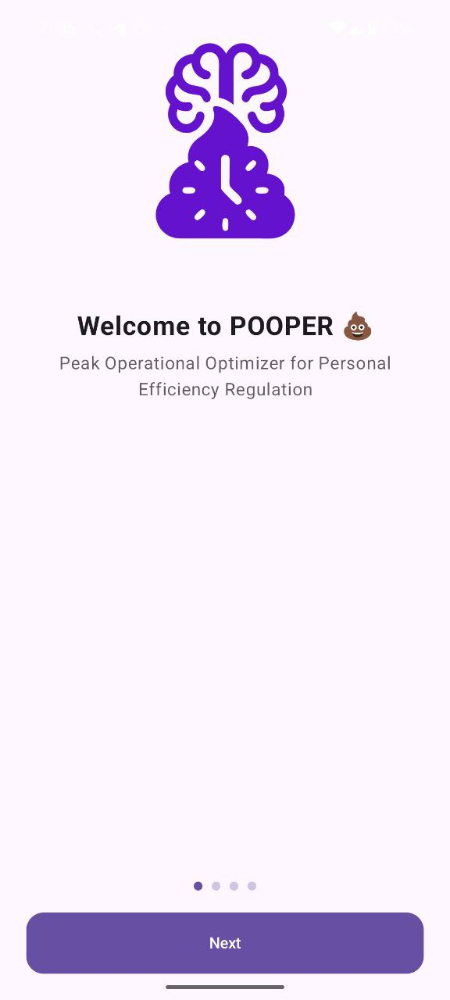
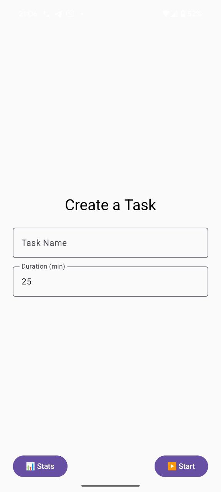
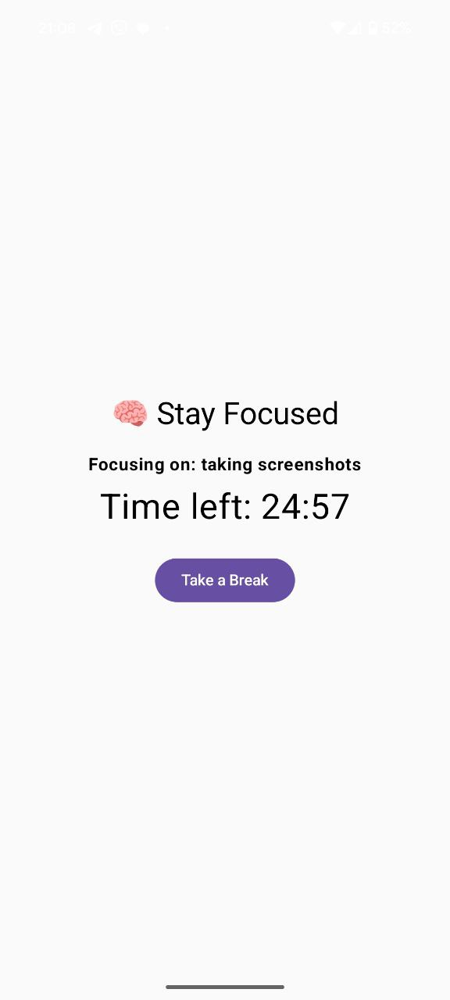

# 💩 Pooper – Focus Like You Mean It

Welcome to **Pooper**: the Peak Operational Optimizer for Personal Efficiency Regulation.

This is not your average productivity app. It's funny, effective, and spiritually optimized for real work — with poop jokes included. 🚽⏱️🧠⚡

---

## 🧠 What Is It?

Pooper is a **focus timer app** built with 🛠 Kotlin + Jetpack Compose using an MVI architecture and Room DB. It helps you break work into tasks, stay laser-focused, and earn breaks — like a productivity-based toilet break system 💩.

---

## 📱 Features

- 🧠 **Focus Timer** – Set a task, choose duration, and get to work.
- ⏳ **Break Management** – After every task, enjoy a well-earned 5-minute break.
- 📈 **Pooping Stats** – Track how many tasks you’ve “pooped out” and total focused minutes.
- 💾 **Local Storage** – All tasks and stats are saved using Room.
- 🚀 **Orientation Support** – App survives rotation without resetting!
- 💬 **Toasts & Vibes** – Friendly reminders when you try to poop with no goal.
- 🎨 **Gradient background, flat icons, emoji UI** — Productivity with a smile.

---

## 📦 Tech Stack

- Kotlin + Jetpack Compose
- AndroidViewModel + ViewModelFactory
- MVI architecture
- Room Database
- CountDownTimer
- LazyColumn, BackHandler, AnimatedVisibility, etc.

---

## 🧪 How To Run

1. Clone the repo
2. Open in Android Studio (Hedgehog+ recommended)
3. Make sure your `libs.versions.toml` has correct dependencies for:
    - Room
    - Lifecycle
    - Compose BOM
4. Run the app on emulator or device (min SDK 28)

---

## 🔮 Ideas for Future

- Sound effects when breaks start
- Notification support
- Themed poop emojis for task streaks
- Wear OS timer mode

---

## 🐛 Known Quirks

- You **can** create a task named `" "` (we warned you)
- Long task history will scroll forever — you must face your past

---

## 👑 Credits

Created for a vibe-coding session.
Logo generated with AI. Built with 💩 and Kotlin.

---

## 📸 Screenshot

### Onboarding

### Let's work

### Create task

### Stay focused

### Break time

### Stats

---

## 🔗 License

MIT – go forth and poop productively.
